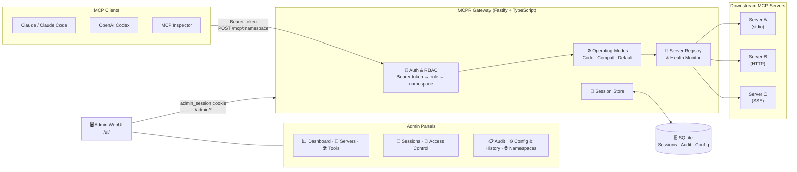

# MCPR Gateway

<p align="center">
  
  <a href="https://github.com/tempont/mcpr-gateway"></a>
  
  
  
  
</p>

**A self-hosted code execution MCP gateway that turns standard upstream MCP servers into sandboxed, dynamically discoverable execution backends — with governed routing and namespace-aware access control.**

> Some say MCP is dead, hopefully we can give it **CPR**.. 🥁

<p align="center">| <a href="https://mcpr-gateway.onrender.com">Demo</a> |</p>

## Inspired by

- [Anthropic's Code Execution](https://www.anthropic.com/engineering/code-execution-with-mcp?_hsmi=390282592)
- [Cloudflare Code Mode](https://blog.cloudflare.com/code-mode-mcp/)

## Current features

<div align="center">

| Category                  | Feature                           | Status    |
|---------------------------|-----------------------------------|-----------|
| **🗄️ Database**          | SQLite Support                    | ✅         |
|                           | PostgreSQL Support                | ❌ Planned |
| **🖥️ Interface & Admin** | WebUI and Admin API               | ✅         |
|                           | Active sessions management        | ✅         |
|                           | Bootstrap file support            | ✅         |
|                           | Config versioning & rollback      | ✅         |
|                           | Config export as JSON             | ✅         |
| **⚙️ Operating Modes**    | All Tools Loaded Mode             | ✅ Default |
|                           | Two-tool Low Schema Mode          | ✅ Compat  |
|                           | BM25 / lexical ranking            | ✅ Compat  |
|                           | Sandbox Execution Tool discovery  | ✅ Code    |
| **📡 Transport**          | HTTP-Streamable Support           | ✅         |
|                           | Stdio Support                     | ❌ Planned |
|                           | Stdio Interactive Auth            | ✅         |
|                           | Protocol version negotiation      | ✅         |
| **🔌 Downstream Servers** | Tool editing                      | ✅         |
|                           | Tool token usage counter          | ✅         |
|                           | Namespaces for isolation          | ✅         |
|                           | Token ENV Support                 | ✅         |
|                           | Encrypted Token SQL Storage       | ✅         |
|                           | OAuth Support                     | ✅         |
|                           | Bearer Token Support              | ✅         |
|                           | Command allowlist (stdio)         | ✅         |
|                           | Health-aware tool ranking         | ✅         |
|                           | Tool quarantining                 | ✅         |
|                           | Server import preview             | ✅         |
| **🛡️ Security**          | External idP + DCR OAuth          | ✅         |
|                           | Bearer token per user/service     | ✅         |
|                           | SSRF protection                   | ✅         |
|                           | Shell injection prevention        | ✅         |
|                           | OAuth URL allowlist (wildcards)   | ✅         |
|                           | Env var sanitization              | ✅         |
|                           | Admin session (HttpOnly cookie)   | ✅         |
|                           | HTTP security headers             | ✅         |
|                           | CORS restricted to loopback       | ✅         |
| **🎯 Focus Mode**         | Adaptive tool window              | ✅         |
|                           | Tool capability inference         | ✅         |
|                           | Write/admin/unhealthy penalties   | ✅         |
|                           | Successful pattern tracking       | ✅         |
| **⚡ Resilience**          | Per-session rate limiting         | ✅         |
|                           | Per-user rate limiting            | ✅         |
|                           | Per-downstream concurrency        | ✅         |
|                           | Circuit breaker                   | ✅         |
|                           | Connect/response/total timeouts   | ✅         |
| **🔄 Triggers**           | refreshOnSuccess                  | ✅         |
|                           | refreshOnTimeout                  | ✅         |
|                           | refreshOnError                    | ✅         |
|                           | FirstSuccessInDomain              | ✅         |
|                           | ErrorThreshold                    | ✅         |
|                           | IdleTimeout                       | ✅         |
|                           | replaceOrAppend mode              | ✅         |
|                           | cooldownSeconds                   | ✅         |
| **📦 Starter Packs**      | preferredTags filtering           | ✅         |
|                           | Risk level filtering              | ✅         |
|                           | Mode filtering                    | ✅         |
|                           | maxTools cap                      | ✅         |
| **💾 Code Runtime**       | Artifact store (save/list)        | ✅         |
|                           | Result APIs (pick/limit/grep)     | ✅         |
|                           | Handle registry (TTL-based)       | ✅         |
|                           | Memory/execution limits           | ✅         |
| **🔐 RBAC**               | Roles (allow/deny namespaces)     | ✅         |
|                           | Permission Management             | ✅         |
|                           | Bearer Token Management           | ✅         |
|                           | Allowed OAuth providers           | ✅         |
| **🏷️ Tool Trust**        | Risk levels (Low/Med/High)        | ✅         |
|                           | Source trust (Untrusted/Verified) | ✅         |
|                           | Schema compression                | ✅         |
| **🔍 Observability**      | Auto refresh tools                | ✅         |
|                           | Audit & Observability             | ✅         |
|                           | Pino structured logging           | ✅         |
|                           | Audit log pruning                 | ✅         |
|                           | Debug endpoints (loopback)        | ✅         |
| **🔌 Client Support**     | Claude Code                       | ✅         |
|                           | OpenAI Codex                      | ✅         |
|                           | OpenCode                          | ✅         |
|                           | Claude Web Client                 | ✅         |
|                           | ChatGPT Web Client                | ✅         |

</div>

## Operating Modes

| Mode        | Tool Window                                         | Best For                               |
|-------------|-----------------------------------------------------|----------------------------------------|
| **Code**    | 2 tools only                                        | Auto orchestration in a JS sandbox     |
| **Compat**  | 4 meta-tools                                        | Large tool sets, minimal context usage |
| **Default** | All enabled downstream tools, filtered by namespace | Full transparency, small tool sets     |

**Go to [Benchmarking](#-benchmarking) for current token-usage comparison details.**

Modes are configured per namespace and can be mixed across different access paths. For instance, you can create a `mcp/dev` with complex tools to be used in code mode or `/mcp/personal` with a small set of tools to be used in default mode for example.

## Demo

<p align="center">
  
</p>

---

## 🏗️ Architecture



---

## ⚡ Quick Setup

### 1. Install and configure

```bash
node --version   # must be 24.x LTS
git clone https://github.com/TempoNaoTenho/mcpr-gateway.git && cd mcpr-gateway
cp .env.example .env
npm ci
npm run build
npm start                 # built UI + MCP gateway on PORT
```

Before running `npm start`, replace `change-me-*` in `.env` with your own secure values.

Use Node 24 LTS. Run: `npm ci`, `npm run build`, then `npm start` (serves UI + gateway on same port). The build step auto-rebuilds `isolated-vm`/`better-sqlite3` if needed.

`.env` is optional; environment variables take priority. The app exits if required security settings are missing or default. Native module fixes and test preflights are automatic for all scripts. Use `npm run setup` if you want help editing `.env` or generating `bootstrap.json`.

App runs at `http://127.0.0.1:3000` (UI at `/ui/`). For development, use `npm run dev` (UI on `PORT`, API on `PORT+1`).

#### Minimum security variables

| Variable                         | Purpose                                         | Required                                |
|----------------------------------|-------------------------------------------------|-----------------------------------------|
| `ADMIN_TOKEN`                    | Enables authentication on all `/admin/*` routes | Yes                                     |
| `GATEWAY_ADMIN_USER`             | Username typed at the admin login               | Yes for production                      |
| `GATEWAY_ADMIN_PASSWORD`         | Password typed at the admin login               | Yes                                     |
| `DOWNSTREAM_AUTH_ENCRYPTION_KEY` | AES-256 key for downstream credentials at rest  | Required for managed downstream secrets |

Without `ADMIN_TOKEN`, the admin panel is **unprotected** — anyone with network access can reach it. The default `npm start` path now fails fast instead of silently accepting missing or placeholder values, whether they come from `.env` or platform-injected environment variables.

```bash
# Export variables in your shell (CI/CD), or pass an env file explicitly:
docker compose --env-file .env -f docker/docker-compose.yml up --build
```

The compose file reads `ADMIN_TOKEN`, `GATEWAY_ADMIN_PASSWORD`, and `DOWNSTREAM_AUTH_ENCRYPTION_KEY` for **interpolation** from the shell/CI environment or an explicit env file such as `--env-file .env`. Runtime **`HOST` inside the container is always `0.0.0.0`** in this file — your dev `.env` value `HOST=127.0.0.1` does not apply there. If `ADMIN_TOKEN` or `GATEWAY_ADMIN_PASSWORD` are missing, `docker compose up` fails immediately with a clear error before the container starts. If `DOWNSTREAM_AUTH_ENCRYPTION_KEY` is malformed, the container exits on startup.

If the UI or `/health` fails from the browser, try **`http://127.0.0.1:3000`** instead of `http://localhost:3000` (some systems resolve `localhost` to IPv6 first).

---

## 🔌 Connect an MCP client

Issue a **client Bearer token** from the Access Control panel at `/ui/access` (or add it to `auth.staticKeys` in `bootstrap.json`), then configure your client.

> 💡 Without `bootstrap.json`, the built-in namespace is `default`. Replace it only when you configure custom namespaces.

---

### 🛠️ Development Tools

#### **Claude Code** (`~/.claude/settings.json`)

```json
{
  "mcpServers": {
    "mcpr-gateway": {
      "type": "http",
      "url": "http://localhost:3000/mcp/<namespace_name>",
      "headers": { "Authorization": "Bearer <your-token>" }
    }
  }
}
```

#### **OpenAI Codex** (`~/.codex/config.toml`)

```toml
[mcp_servers.mcpr-gateway]
type = "http"
url  = "http://localhost:3000/mcp/<namespace_name>"
bearer_token_env_var = "MCPR_GATEWAY_TOKEN"
```

```bash
export MCPR_GATEWAY_TOKEN=<your-token>
```

#### **OpenCode**

```bash
# Add via CLI or config file
opencode mcp add mcpr-gateway \
  --url "http://localhost:3000/mcp/<namespace_name>" \
  --token "<your-token>"
```

---

### 🌐 Web Clients

#### **Claude Web** (claude.ai)

1. Go to **Settings** → **Integrations** → **MCP Servers**
2. Click **Add Integration**
3. Fill the form:
   - **Name**: `MCPR Gateway`
   - **URL**: `http://localhost:3000/mcp/<namespace_name>`
4. Save and enable the integration

#### **ChatGPT Web** (chat.openai.com)

1. Go to **Settings** → **Plugins** → **MCP Servers** (or search "MCP" in plugin store)
2. Add a new MCP server
3. Configure:
   - **Server URL**: `http://localhost:3000/mcp/<namespace_name>`
4. Save and activate

**Both supports OAuth.**

---

### 🔗 Any HTTP MCP Client

Send `Authorization: Bearer <token>` on every request. After `initialize`, include the `Mcp-Session-Id` header returned by the gateway.

---

## 🔍 Feature Details

### 🔐 Security

| Concern                | Implementation                                                                                                                                                                 |
|------------------------|--------------------------------------------------------------------------------------------------------------------------------------------------------------------------------|
| Client auth            | Bearer token per user/service, issued via Admin UI or `auth.staticKeys` in bootstrap                                                                                           |
| Admin protection       | `ADMIN_TOKEN` enables login; `GATEWAY_ADMIN_USER` / `GATEWAY_ADMIN_PASSWORD` are the credentials; in `NODE_ENV=production` with no `ADMIN_TOKEN`, admin routes are not mounted |
| Downstream credentials | AES-encrypted in SQLite when `DOWNSTREAM_AUTH_ENCRYPTION_KEY` is set                                                                                                           |
| HTTP security headers  | `@fastify/helmet` applied to all responses                                                                                                                                     |
| CORS                   | Restricted to loopback origins (`localhost`, `127.0.0.1`, `::1`) for MCP endpoints                                                                                             |

### 🌐 Sessions & Transport

| Topic          | Detail                                                                           |
|----------------|----------------------------------------------------------------------------------|
| Persistence    | SQLite (default) or in-memory (`SESSION_BACKEND=memory`)                         |
| TTL            | 30 min default (`session.ttlSeconds = 1800`), automatic cleanup                  |
| Transport      | HTTP-Streamable: `GET /mcp/:namespace` (SSE) + `POST /mcp/:namespace` (JSON-RPC) |
| Session header | `Mcp-Session-Id` required on all requests after `initialize`                     |
| Admin ops      | Query, inspect, and revoke sessions via `/ui/sessions` or `GET /admin/sessions`  |

### 🔌 Downstream Servers

| Topic             | Detail                                                                  |
|-------------------|-------------------------------------------------------------------------|
| Transports        | `stdio` and `http` / streamable-HTTP                                    |
| Auth options      | `none`, `bearer` (env var or inline), `oauth`                           |
| Credentials       | Encrypted at rest; UI-managed via `/ui/servers`                         |
| Health monitoring | Continuous checks; degraded servers penalized in tool selection ranking |
| Namespacing       | Servers assigned per namespace; tool pool isolated per access path      |

### 🛡️ Role-Based Access Control

| Concept   | Description                                                                  |
|-----------|------------------------------------------------------------------------------|
| Namespace | Isolated access path — e.g. `/mcp/dev`, `/mcp/prod`, `/mcp/personal`         |
| Role      | Maps a bearer token to one or more namespaces with allowed operating modes   |
| Token     | Per-client Bearer token, issued via Admin UI and stored in SQLite            |
| Auth mode | `static_key` — token resolved to role; role checked against namespace policy |

### 🖥️ Admin WebUI

Served at `/ui/` — **SvelteKit 2 + TailwindCSS v4**. Requires admin login when `ADMIN_TOKEN` is set.

| Panel          | Path             | What you can do                                                    |
|----------------|------------------|--------------------------------------------------------------------|
| Dashboard      | `/ui/`           | Session counts, server health overview                             |
| Servers        | `/ui/servers`    | Add, edit, delete downstream servers; view health status           |
| Sessions       | `/ui/sessions`   | Inspect active sessions; revoke individual sessions                |
| Access Control | `/ui/access`     | Issue and revoke client bearer tokens                              |
| Audit          | `/ui/audit`      | Browse events filtered by user, tool, event type, date range       |
| Config         | `/ui/config`     | Edit runtime config; view full version history; one-click rollback |
| Namespaces     | `/ui/namespaces` | Token estimates, catalog sizes, mode metrics per namespace         |
| Tools          | `/ui/tools`      | Browse full downstream tool catalog                                |

### 📊 Audit & Observability

| Topic        | Detail                                                                                         |
|--------------|------------------------------------------------------------------------------------------------|
| Logging      | Pino structured logs to stdout; level set via `LOG_LEVEL` env var                              |
| Audit trail  | SQLite-persisted per-event records; prunable by retention window (`AUDIT_RETENTION_DAYS`)      |
| Audit events | `SessionCreated`, `ToolExecuted`, `ExecutionDenied`, `DownstreamMarkedUnhealthy`               |
| Query API    | `GET /admin/audit` — filters: `session_id`, `user_id`, `event_type`, `tool_name`, `from`, `to` |

### ⚡ Resilience

| Feature                | Config key                 | Default                                       |
|------------------------|----------------------------|-----------------------------------------------|
| Rate limiting          | `resilience.rateLimit.*`   | Per-session and per-user windows              |
| Downstream concurrency | `resilience.concurrency.*` | Per-server cap                                |
| Response timeout       | `resilience.timeoutMs`     | Configurable                                  |
| Health-aware ranking   | Automatic                  | Unhealthy servers penalized in tool selection |

---

### 🔍 Benchmarking

- Current benchmark suite is a work in progress and is not yet ready for production use. Ideally we should compare token usage for discovery tools and complete tool execution cases.

#### Benchmark results

**Scenario: native benchmark**

```bash
export BENCH_AUTH_HEADER="Bearer key"
npm run benchmark -- real --namespaces name_space1, name_space_2, ...
```

`~10 common dev mcp servers` with `~30 tools total` (context7, tavily, etc)

| Mode    | Retrieval recall@3 | MRR | E2E Success | Avg Tokens Loaded in Context | Reduction % |
|---------|--------------------|-----|-------------|------------------------------|-------------|
| code    | 1                  | 1   | 1           | 703.2                        | ~92%        |
| default | 1                  | 1   | 1           | 9138.2                       | 0%          |

**Scenario: real-usage on MCP Client**

| Mode    | Tool invocations | Σ totalTokensEstimate | Σ HTTP responseTime (ms) |
|---------|------------------|-----------------------|--------------------------|
| code    | 3                | 2309                  | 11051.31                 |
| compat  | 7                | 4470                  | 6707.00                  |
| default | 4                | 3338                  | 9369.15                  |

### 📝 To-do

- [ ] Create a realistic benchmark suite to compare different modes and downstream servers
- [ ] Implement Gateway stdio transport
- [ ] Implement PostgreSQL support

## 📚 Documentation

| Guide                                      | Audience               | Contents                                                                     |
|--------------------------------------------|------------------------|------------------------------------------------------------------------------|
| [Getting Started](docs/GETTING-STARTED.md) | Operators, integrators | Dependencies, setup, MCP client flow, auth basics                            |
| [Configuration](docs/CONFIGURATION.md)     | Operators              | `bootstrap.json`, selector publication, `CONFIG_PATH`, two-tier config model |
| [Architecture](docs/ARCHITECTURE.md)       | Contributors           | Sessions, registry, selector, triggers, high-level flow                      |
| [HTTP API](docs/reference/HTTP-API.md)     | Integrators            | Health, MCP JSON-RPC, admin, debug, static UI — full endpoint reference      |
| [Deployment](docs/DEPLOYMENT.md)           | Operators              | Docker Compose, persistence, production hardening, TLS                       |
| [Development](docs/DEVELOPMENT.md)         | Contributors           | npm scripts, project layout, tests, Web UI workflow                          |
| [Changelog](docs/CHANGELOG.md)             | Operators, adopters    | Release notes, runtime requirements, known caveats                           |

> Config schema source of truth: [`src/config/schemas.ts`](src/config/schemas.ts). For bootstrap examples and copy-paste snippets, see [`config/README.md`](config/README.md).

---

## 📄 License

MIT — see [LICENSE](./LICENSE).
